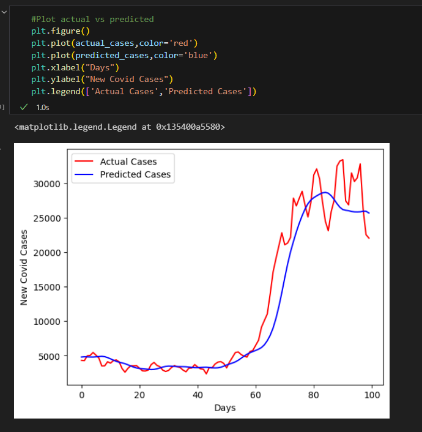
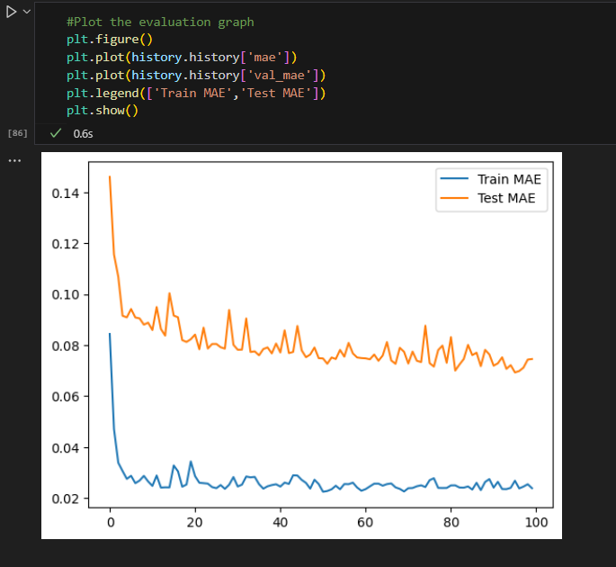
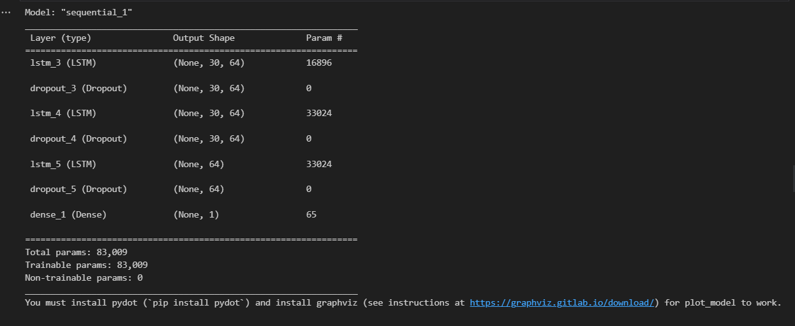
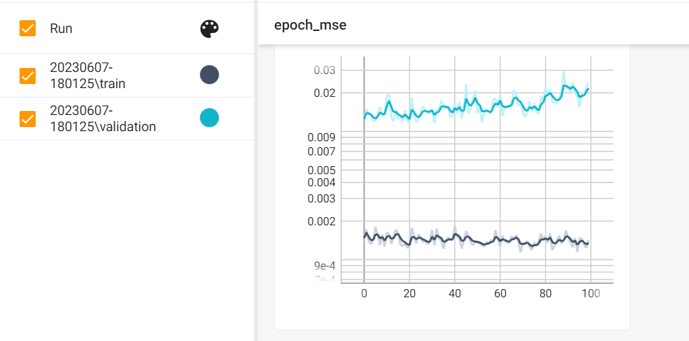

# COVID-19 Case Prediction using LSTM Neural Network
This project aims to create a deep learning model using LSTM neural network to predict new COVID-19 cases in Malaysia. The model utilizes the past 30 days of case data to forecast future case numbers. The goal is to achieve an MAPE (Mean Absolute Percentage Error) of less than 1% when tested against a testing dataset. The model's predictions will help determine if travel bans should be imposed or rescinded.
## Project Description
The year 2020 witnessed the global spread of the COVID-19 pandemic, leading to widespread disruptions and loss of lives. Scientists believe that the absence of AI-assisted automated tracking and predicting systems contributed to the rapid spread of the virus. Therefore, deep learning models, such as LSTM neural networks, can be utilized to predict daily COVID-19 cases accurately.
### Challenges Faced and Solutions
Challenges:
- Data collection: Ensuring the availability and reliability of daily COVID-19 case data for Malaysia.
- Model optimization: Determining the optimal number of LSTM nodes and the depth of the model to balance accuracy and efficiency.
- MAPE error control: Fine-tuning the model to achieve an MAPE error of less than 1% to ensure accurate predictions.

To overcome these challenges:
- Gathered the daily COVID-19 case data from https://github.com/MoH-Malaysia/covid19-public to ensure accurate and up-to-date information.
- Performed iterative experimentation and tuning to find the optimal architecture and hyperparameters for the LSTM model.
- Implemented regularization techniques and adjusted the model's parameters to minimize the MAPE error and improve prediction accuracy.
### Future Challenges and Features
Moving forward, we hope to address the following challenges and implement additional features:
- Incorporating external factors: Considering other variables such as vaccination rates, government interventions, and public sentiment to enhance the predictive capabilities of the model.
- Real-time prediction: Developing a system to provide real-time COVID-19 case predictions, allowing timely decision-making for public health authorities.
## Installation and Usage
To install and run the project, follow these steps:
### 1. Clone the repository to your local machine using the following command:
git clone https://github.com/your-username/your-repository.git
### 2. Install the required dependencies by running the following command:
```shell
pip install tensorflow==2.6.0
pip install numpy==1.21.2
pip install matplotlib==3.4.3
```
### 3. Prepare your dataset with the daily COVID-19 case numbers for Malaysia. Ensure the data is in the appropriate format and stored in the data directory.
### 4. Adjust the model parameters, such as the number of LSTM nodes and the window size, in the farah_capstone1_covid.ipynb file according to your needs.
### 5. Generate predictions using the trained model (in H5 and PKL formats) to forecast future COVID-19 cases in Malaysia by running the following commands:
For H5 format:
```shell
python predict.py --model=h5 --model-path=saved_models.h5
```
For PKL format:
```shell
python predict.py --model=pkl --model-path=saved_models.pkl
```
### 6. Monitor the training loss and performance using TensorBoard by running the following command:
```shell
tensorboard --logdir tensorboard_logs/capstone1
```
## Model Criteria
- The model architecture should consist of LSTM, Dense, and Dropout layers.
- The LSTM layers should have a maximum of 64 nodes, and the model's depth can be adjusted based on requirements.
- The window size for input data should be set to 30 days.
- The Mean Absolute Percentage Error (MAPE) should be less than 1% when evaluated on the testing dataset. The MAPE is calculated using the formula:
  Mean Absolute Percentage Error = (Mean Absolute Error / (sum(actual)) * 100%
- The training loss displayed using TensorBoard.
## Software
- Visual Studio Code
- TensorFlow framework
## Methodology
1) Problem Definition: The goal is to develop a predictive model that can forecast the number of new COVID-19 cases (cases_new) in Malaysia for future time steps based on the historical data of the number of cases over the past 30 days
2) Data Collection: Gather the historical data of the number of COVID-19 cases in Malaysia, including the daily counts of cases over the past 30 days. The dataset includes the dates and the corresponding number of cases_new for each date.
3) Data Preprocessing: Perform necessary preprocessing steps like KNNImputer to handle the missing values and MinMaxScaler for scaling the data.
4) LSTM Model Architecture: Design the LSTM neural network architecture for the prediction task. The model take the past 30 days' worth of cases as input and predict the number of new cases for the next time step. The number of LSTM layers was set to 64, there is no activation function since usually reggression dont need activation and dense was set to 1.
5) Model Training: Train the LSTM model using the prepared training dataset. This involves feeding the input sequences of the past 30 days' cases and training the model to predict the next day's number of new cases. Configure the training parameters by setting the number of epochs to 100.
6) Model Evaluation: Evaluate the trained LSTM model using the testing dataset. Measure the performance of the model using  mean absolute error (MAE). Assess the model's ability to accurately predict the number of new cases in Malaysia.
7) Model Deployment: Once satisfied with the model's performance, deploy it to make predictions on new, unseen data. Implement a mechanism to input the latest available data and obtain the model's predictions for future time steps.
## Project Output
Below are some sample visualizations generated by the project:
- Graph Predicted VS Actual:



- Model Performance:



- Model Architecture:



- Tensorboard MSE:



## Credits
The COVID-19 case data used in this project is sourced from:
https://github.com/MoH-Malaysia/covid19-public
## Contributing
Contributions to this project are welcome. If you find any issues or have suggestions for improvement, please open an issue or submit a pull request on the GitHub repository.
